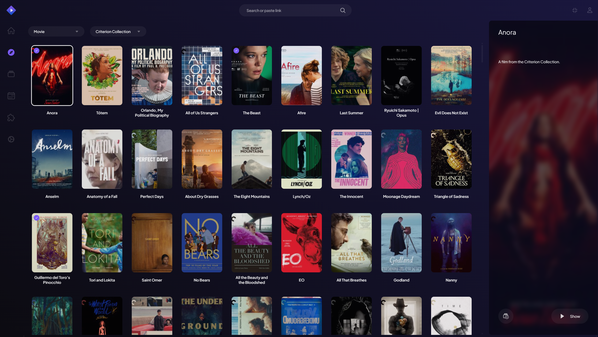
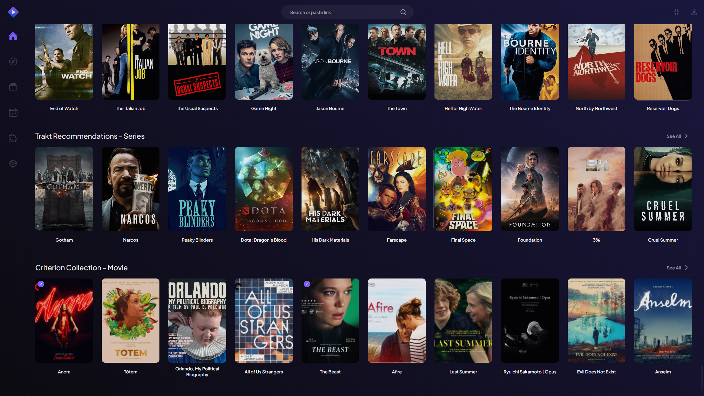

   ---

   # **🎬 Criterion Collection Stremio Add-on**

   
   

   A **Stremio add-on** that lists **Criterion Collection Films** with metadata, posters, and more. This add-on:
   - ✅ **Scrapes movie data** directly from **Criterion's website** using **Selenium-Stealth**.
   - ✅ **Loads movie data dynamically from** `criterion_movies.json` inside Stremio.
   - ✅ **Integrates with Stremio Add-on SDK** to display movies **with posters** inside Stremio.

   ---

   ## **📡 Now Hosted on Render**
   The add-on is now **hosted on Render.com** and can be added to **Stremio** using the following link:

   🔗 **[Criterion Collection Add-on for Stremio](https://criterion-collection-add-on-stremio-qvt7.onrender.com/manifest.json)**

   ### **How to Add to Stremio (For Users)**
   1. Open **Stremio**.
   2. Go to **Settings > Add-ons**.
   3. Click **"Install via URL"** and paste the following link:
      ```
      https://criterion-collection-add-on-stremio-qvt7.onrender.com/manifest.json
      ```
   4. Click **"Install"**, and you're all set! 🎬

   ---

   ## **📌 Features**
   - ✅ **Browse Criterion Collection movies** inside Stremio.
   - ✅ **Movie Metadata** (Title, Poster, IMDb ID).
   - ✅ **Selenium-Stealth Scraper** to bypass bot protections.
   - ✅ **Dynamically loads** `criterion_movies.json` for updates (No need to restart Stremio).
   - ✅ **Deployment options** (Render, Glitch, Docker).

   ---

   ## **🚀 Getting Started (For Developers)**

   ### **1️⃣ Clone the Repository**
   First, clone the repository:
   ```sh
   git clone https://github.com/your-username/criterion-stremio-addon.git
   cd criterion-stremio-addon
   ```

   ---

   ### **2️⃣ Install Dependencies**
   Ensure you have **Python**, **Node.js**, and **Docker** installed.

   #### **🐍 Python Dependencies**
   Run:
   ```sh
   pip install selenium webdriver-manager selenium-stealth flask flask-cors python-dotenv
   ```

   #### **🟢 Node.js Dependencies**
   Run:
   ```sh
   npm install stremio-addon-sdk
   ```

   #### **🐳 Install Docker (Optional for Containerized Deployment)**
   If you prefer running this as a **Docker container**, install Docker from:  
   ➡️ [**Docker Installation Guide**](https://www.docker.com/get-started)

   ---

   ## **🕵️‍♂️ Step 1: Scrape Criterion Movie List**
   This script **scrapes movie data** directly from the **Criterion website**.

   ### **🔹 Run the scraper**
   Run:
   ```sh
   python scraper.py
   ```
   - This will generate `criterion_movies.json`.

   ---

   ## **🎬 Step 2: Run the Stremio Add-on**
   This script integrates the scraped data with Stremio Add-on SDK.

   ### **🔹 Run the Stremio Add-on**
   ```sh
   node stremio_addon.js
   ```
   - The add-on will start at: **`http://localhost:7000/manifest.json`**  
   - Open this URL in your browser to confirm it’s working.

   ---

   ## **📡 Step 3: Add to Stremio**
   1. Open **Stremio**.
   2. Go to **Add-ons > Developer Mode > Add an Add-on**.
   3. Enter:
      ```
      http://localhost:7000/manifest.json
      ```
   4. Click **Install**, then check if movies appear inside Stremio!

   ---

   # **🐳 Running with Docker**

   ## **1️⃣ Build Docker Image**

   - **`Dockerfile.node`** for the Stremio add-on.

   ### **🔹 Build the Stremio Add-on Image**
   ```sh
   docker build -t node -f Dockerfile.node .
   ```

   ---

   ## **2️⃣ Set Up Your API Key (If you want to use your own)**
   You need to **insert your OMDb API key** in **`.env`** or **`compose.yaml`**.

   #### **🔹 Option 1: Using `.env`**
   Create a `.env` file in your project directory:
   ```
   OMDB_API_KEY=your_actual_omdb_api_key
   ```

   #### **🔹 Option 2: Using `docker-compose.yaml`**
   Modify `docker-compose.yaml` and add:
   ```yaml
   services:
   flask:
      environment:
         - OMDB_API_KEY=your_actual_omdb_api_key
   ```

   ---

   ## **3️⃣ Run Everything with Docker Compose**
   To start the **container** (Stremio Add-on):
   ```sh
   docker-compose up
   ```
   - Stremio Add-on runs at: **http://localhost:7000/manifest.json**

   ---

   ## **🚀 Fix: If Movies Are Not Showing in Stremio**
   If the add-on installs but **doesn’t show movies**, do the following:

   ### **✅ Fix 1: Ensure `stremio_addon.js` is Correct**
   Make sure the `stremio_addon.js` script includes the `"type": "movie"` field in both the **catalog and meta responses**. Stremio requires this for proper functionality.

   ### **✅ Fix 2: Check the Catalog Endpoint**
   Visit:
   ```
   http://localhost:7000/catalog/movie/criterion.json
   ```
   Ensure it returns a valid JSON response with movie data.

   ### **✅ Fix 3: Check the Meta Endpoint**
   Visit:
   ```
   http://localhost:7000/meta/movie/tt28607951.json
   ```
   Ensure the response includes the `"type": "movie"` field.

   ### **✅ Fix 4: Restart Stremio & Reinstall the Add-on**
   1. **Remove the add-on** from Stremio.
   2. **Reinstall it** using:
      ```
      http://localhost:7000/manifest.json
      ```
   3. **Restart Stremio completely** and check if movies appear.

   ---

   ## **🔄 Hosting the Stremio Add-on**

   ### **📡 Deploying the Stremio Add-on**
   1. **Render.com (Current Hosting)**
      - The add-on is already hosted on Render at:
      ```
      https://criterion-collection-add-on-stremio-qvt7.onrender.com/manifest.json
      ```
   2. **VPS (DigitalOcean, Linode, etc.)**
      - Use **PM2** to keep the Stremio add-on running persistently.

   ---

   ## **🎯 Next Steps**
   ✅ **Improve the film descriptions to provide better metadata.**  
   ❌ **Explore alternatives to Render for hosting in the future.**  

   ---

   ## **🚀 Need Help?**
   If you need help with deployment, Docker, or adding new features, feel free to ask! 🎬🚀

   ---

   ### **🔥 Summary of Commands**
   #### **📝 Local Setup**
   ```sh
   pip install -r requirements.txt
   npm install
   python scraper.py
   node stremio_addon.js
   ```

   #### **🐳 Docker Setup**
   ```sh
   docker build -t node -f Dockerfile.node .
   docker-compose up
   ```

   🚀 **Enjoy streaming Criterion movies in Stremio!** 🎬  

   ---

