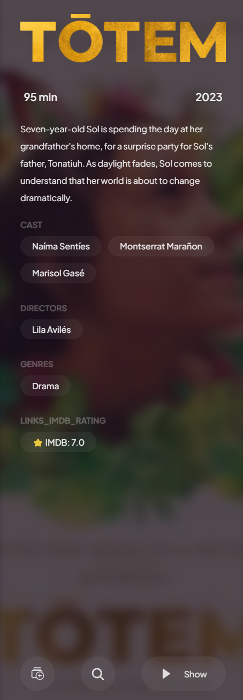
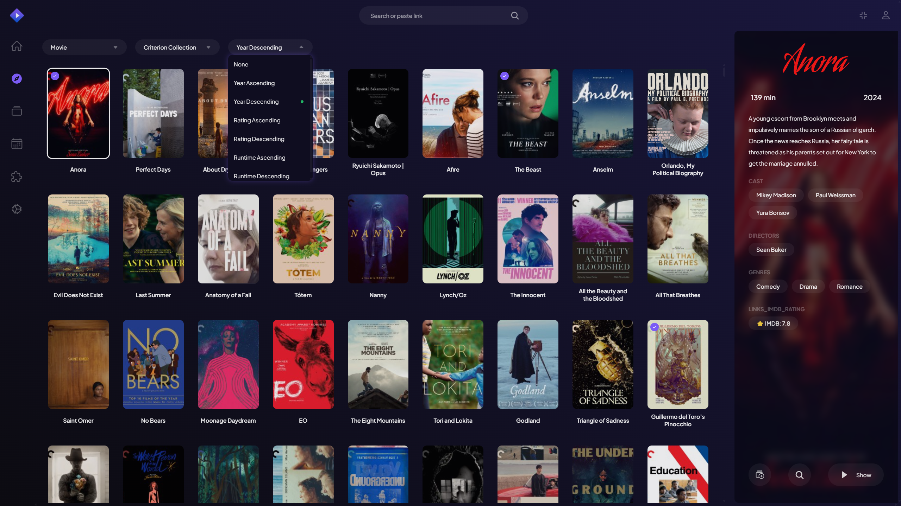

---

# **🎬 Criterion Collection Stremio Add-on**  

Enhance your **Stremio experience** with a dedicated add-on for the **Criterion Collection**. Browse classic and contemporary films with **high-quality metadata**, **posters**, and seamless **integration** into Stremio.  

---

## **🖥️ Stremio Interface Preview**  

### **🔹 Discover Page View**  
> Explore the Criterion Collection directly within Stremio.  


---

### **🏠 Home Page View**  
> See the collection featured on your Stremio home screen.  


---

### **🔍 Meta View / Catalog View**
> Browse the Criterion Collection with a sleek and intuitive catalog view.

<div style="display: flex; align-items: center; gap: 8px;">
   
   
   
   
</div>

---

### **🔹 Sorting Feature (NEW!)**  
> Easily sort movies by Year, Rating, and Runtime in ascending or descending order!  



- **Sorting Options Available:**
  - 📅 **Year (Oldest First)** → `Year Ascending`
  - 📅 **Year (Newest First)** → `Year Descending`
  - ⭐ **IMDb Rating (Lowest to Highest)** → `Rating Ascending`
  - ⭐ **IMDb Rating (Highest to Lowest)** → `Rating Descending`
  - ⏳ **Runtime (Shortest First)** → `Runtime Ascending`
  - ⏳ **Runtime (Longest First)** → `Runtime Descending`

Simply **click the sorting menu** in Stremio’s **Discover section** to change the sorting order!

---

## **📡 Now Hosted on Render**
The add-on is now **hosted on Render.com** and can be added to **Stremio** using the following link:

### **How to Add to Stremio (For Users)**
1. Open **Stremio**.
2. Go to **Settings > Add-ons**.
3. Click **"Install via URL"** and paste the following link:
   ```
   https://criterion-collection-add-on-stremio-qvt7.onrender.com/manifest.json
   ```
4. Click **"Install"**, and you're all set! 🎬

---

## **📌 Features**
- ✅ **Browse Criterion Collection movies** inside Stremio.
- ✅ **Advanced Sorting** (Sort by Year, Rating, and Runtime).
- ✅ **Movie Metadata** (Title, Poster, IMDb Rating, Runtime).
- ✅ **Dynamically loads** `criterion_movies.json` (No need to restart Stremio).
- ✅ **Deployable on Render, VPS, or Docker**.

---

## **🚀 Getting Started (For Developers)**

### **1️⃣ Clone the Repository**
First, clone the repository:
```sh
git clone https://github.com/your-username/criterion-stremio-addon.git
cd criterion-stremio-addon
```

---

### **2️⃣ Install Dependencies**
Ensure you have **Python**, **Node.js**, and **Docker** installed.

#### **🐍 Python Dependencies**
Run:
```sh
pip install selenium webdriver-manager selenium-stealth flask flask-cors python-dotenv
```

#### **🟢 Node.js Dependencies**
Run:
```sh
npm install stremio-addon-sdk
```

#### **🐳 Install Docker (Optional for Containerized Deployment)**
If you prefer running this as a **Docker container**, install Docker from:  
➡️ [**Docker Installation Guide**](https://www.docker.com/get-started)

---

## **🕵️‍♂️ Step 1: Scrape Criterion Movie List**
This script **scrapes movie data** directly from the **Criterion website**.

### **🔹 Run the scraper**
Run:
```sh
python scraper.py
```
- This will generate `criterion_movies.json`.

---

## **🎬 Step 2: Run the Stremio Add-on**
This script integrates the scraped data with Stremio Add-on SDK.

### **🔹 Run the Stremio Add-on**
```sh
node stremio_addon.js
```
- The add-on will start at: **`http://localhost:7000/manifest.json`**  
- Open this URL in your browser to confirm it’s working.

---

## **📡 Step 3: Add to Stremio**
1. Open **Stremio**.
2. Go to **Add-ons > Developer Mode > Add an Add-on**.
3. Enter:
   ```
   http://localhost:7000/manifest.json
   ```
4. Click **Install**, then check if movies appear inside Stremio!

---

# **🐳 Running with Docker**

## **1️⃣ Build Docker Image**
Run the following command to build the Docker image:
```sh
docker build -t my-stremio-addon .
```

---

## **2️⃣ Run the Docker Container**
Once the image is built, run the container:
```sh
docker run -p 7000:7000 my-stremio-addon
```
- The add-on will be accessible at: **`http://localhost:7000/manifest.json`**

---

## **🚀 Fix: If Movies Are Not Showing in Stremio**
If the add-on installs but **doesn’t show movies**, do the following:

### **✅ Fix 1: Ensure `stremio_addon.js` is Correct**
Make sure the `stremio_addon.js` script includes the `"type": "movie"` field in both the **catalog and meta responses**.

### **✅ Fix 2: Check the Catalog Endpoint**
Visit:
```
http://localhost:7000/catalog/movie/criterion.json
```
Ensure it returns a valid JSON response with movie data.

### **✅ Fix 3: Restart Stremio & Reinstall the Add-on**
1. **Remove the add-on** from Stremio.
2. **Reinstall it** using:
   ```
   http://localhost:7000/manifest.json
   ```
3. **Restart Stremio completely** and check if movies appear.

---

## **🔄 Hosting the Stremio Add-on**

### **📡 Deploying the Stremio Add-on**
1. **Render.com (Current Hosting)**
   - The add-on is already hosted on Render at:
   ```
   https://criterion-collection-add-on-stremio-qvt7.onrender.com/manifest.json
   ```
2. **VPS (DigitalOcean, Linode, etc.)**
   - Use **PM2** to keep the Stremio add-on running persistently.

---

### **🔥 Summary of Commands**
#### **📝 Local Setup**
```sh
pip install -r requirements.txt
npm install
python scraper.py
node stremio_addon.js
```

#### **🐳 Docker Setup**
```sh
docker build -t my-stremio-addon .
docker run -p 7000:7000 my-stremio-addon
```

🚀 **Enjoy streaming Criterion movies in Stremio!** 🎬 

---